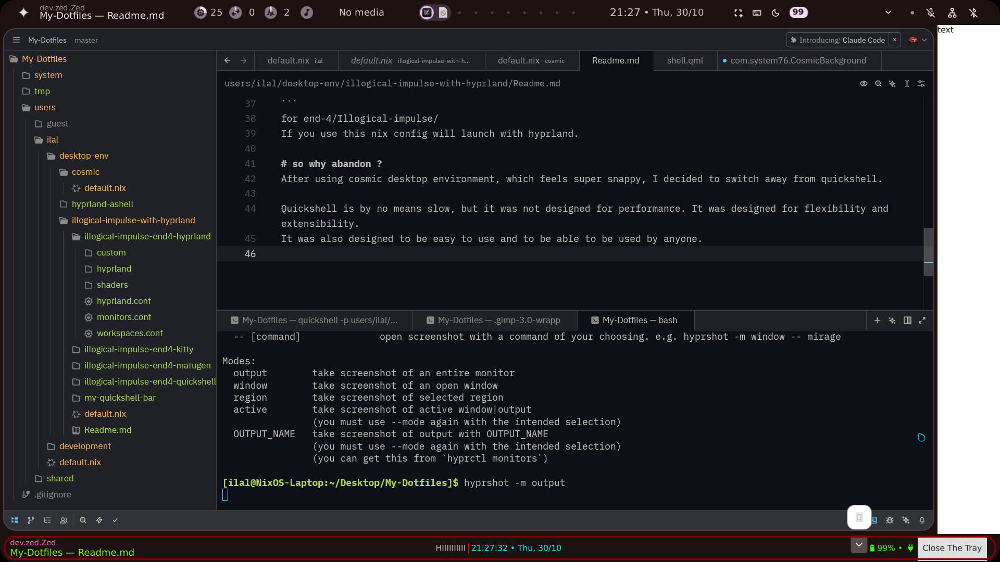

# Illogical impulse on nixos

this is a some old version of ii
see https://github.com/end-4/dots-hyprland/

then is started working on my own version of Quickshell panel
Lazily named `my-quickshell-bar`

With the creative idea of everything (applets) being extensionextensions

If you are working on your own version of Quickshell panel, you can use this as a reference. :)
like Systray implementation, especially how to create anchored panel (/my-quickshell-bar/extensions/QuickSettingsPanel) etc.
My implementation was better than the end-4/Illogical-impulse's one :').
How to isolate sections of code etc.

```
/shell.qml  # root to spawn bar, panels/windows, services etc

/config/ # was supposed for config/settings (appearence) to share between applets

/core/        # core lib, somthing to not be updated frequently, bar base (and was supposed to be window spwaner and settings etc.)
  /bar/       # bar's core's code.
  /templates/ # templated componets

/extensions # WHERE FUN THINGS HAPPEN, everything on bar, windows/panels etc.
  /<extension name>/ # Various extensions
  /Layout_Bar.qml    # where your bar layout is decided,
  /Layout_Main.qml   # was supposed to help spawning of settings options, panels (like Notifications, Quicksettings) etc.

/.qmlformat.ini # ignore me, for qml language server on your editor
```


* **Above is end-4/illogical-impulse,**
* **Below is /my-quickshell-bar/**

# how to run
for my-quickshell-bar/
```shell
quickshell -p users/ilal/desktop-env/illogical-impulse-with-hyprland/my-quickshell-bar/
```
for end-4/Illogical-impulse/
- If you use this nix config, will launch with hyprland.

# so why abandon ?
After using cosmic desktop environment, which feels super snappy, I decided to switch away from quickshell.

Quickshell is by no means slow, but it was not designed for performance. It was designed for flexibility and extensibility.
It was also designed to be easy to use and to be able to be used by anyone.
